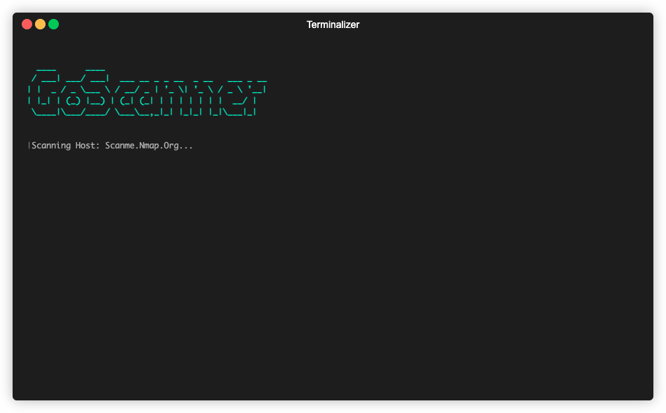

# GoScanner



GoScanner is a lightweight IP/PORT scanner written in Go. It performs a stealth SYN scan to determine open ports. The scanner can target a single IP address or multiple IP addresses within a CIDR range.
## Purpose

This project is designed to practice Go's parallelization techniques using channels, contexts, and timeouts.  It was inspired by the [synscan example](https://github.com/google/gopacket/blob/master/examples/synscan/main.go) from the `gopacket` GitHub repository.


## Usage

### Command-Line Options

- `-p`: Specify ports to scan. This can be a comma-separated list (e.g., `22,80,443`) or a range (e.g., `1-19`).
- `-t`: Set a timeout for the scan in seconds.
- `-w`: Set the number of worker goroutines to use during the scan.

## Running the Code

You can run GoScanner in two ways:

1. **Directly using Go**:

```bash
go run . [options]
```

2. **Build the Docker image**:

```bash
docker build -t goscan .
```
**Run the container**:

```bash
docker run --rm --network host -it -e "TERM=xterm-256color" goscan Scanme.Nmap.Org -p 1-100
```
✨The TERM=xterm-256color environment variable is used to enable some nice colors✨
